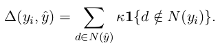

cs224d lecture9

  关键词
  
    ·LSTM
    
    ·recursive neural network(递归神经网络，RcNN,区别于RNN（循环神经网络）)
    
        word vector space model
        
        
          通常我们把单词以向量形式表示在向量空间中
          那么我们怎么表示短语甚至是句子？
          By mapping them into the same vector space!
          把一个句子在词向量空间中表示，先将每两个相邻单词通过算法（没具体讲）得到一个新的向量和一个得分（score），该向量与词向量同维度，得分越高说相应的两个单词组合在一起有更大的几率是合理的，重复这一过程，最终得到的一棵语法树就代表该句子的向量。
          
        
        如何训练该模型？————max-margin parsing
        
        
        
          论文里给出的object function是这样的，其中delta(yi, y_hat)是根据标记错误的node数量再乘以一个k得出的：
        
        
        
          如果w不是最优的w那么max()里左边的score选出来的不是y_i，再加上L_i那么最终肯定是ri很大，必然不是最小的；如果w是最优的呢？那肯定max()选出来的是yi，delta肯定为零，然后总体必然最小。这样的w必然使得score(y_i)比其他所有的score(y)大，并且大出来一个L_i(y)的margin。
          
      ·BPTS
      
      ·Recursive NN的改良版
